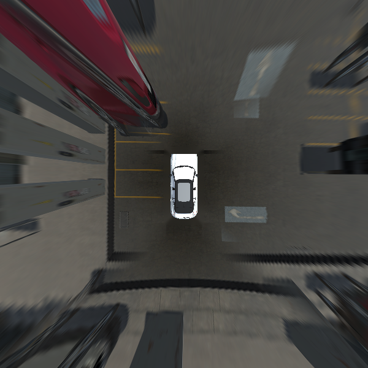
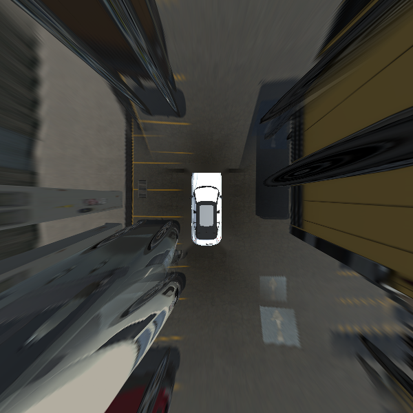
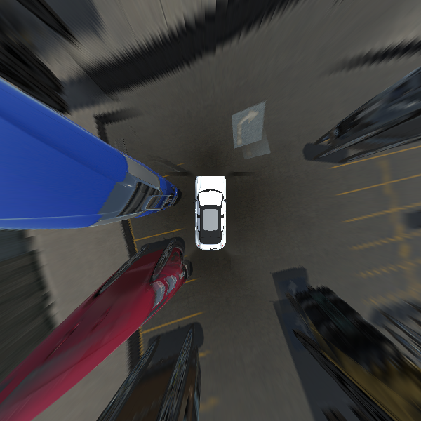

# fbssem-bev

Standalone FB-SSEM fisheye-to-bird's-eye-view transformation package using
vectorized NumPy geometry and OpenCV image operations.

The package does not import `surround_view`, PyQt, or any script from the parent
repository. It can be moved to another directory and run against any FB-SSEM
dataset with the expected layout.

> **Proprietary software:** no use, copying, modification, or distribution is
> permitted without prior written permission from the copyright holder. See
> [LICENSE](LICENSE).

## Features

- Exact Mei omnidirectional projection using FB-SSEM `K`, `D`, and `xi`.
- Direct raw-fisheye-to-ground sampling without an intermediate perspective
  warp.
- Official FB-SSEM `600x600` frame, `24 px/m`, and rear-axle origin
  `(300, 333)`.
- NumPy projection maps, blend weights, image blending, and tone gains.
- Cached rectilinear diagnostic previews.
- Masked ego-vehicle compositing and bounded blind-region filling.
- Scikit-learn-style `fit`, `transform`, `fit_transform`, `get_params`, and
  `set_params` API.
- Installable `fbssem-bev` command.
- Synthetic tests that do not require downloading FB-SSEM.

## Example results

These examples were generated by the package from local FB-SSEM camera images.
Only these selected outputs are stored in the repository; the source dataset
and complete generated output directories are ignored.

| Sample 0 | Sample 50 | Sample 99 |
| --- | --- | --- |
|  |  |  |

## Package layout

```text
fbssem-bev/
├── .github/workflows/ci.yml
├── .editorconfig
├── .gitattributes
├── .gitignore
├── .python-version
├── docs/results/
│   ├── bev_000.png
│   ├── bev_050.png
│   └── bev_099.png
├── LICENSE
├── pyproject.toml
├── uv.lock
├── README.md
├── RELEASES.md
├── CONTRIBUTING.md
├── SECURITY.md
├── src/fbssem_bev/
│   ├── __init__.py
│   ├── __main__.py
│   ├── _calibration.py
│   ├── _config.py
│   ├── _estimator.py
│   ├── _geometry.py
│   └── cli.py
└── tests/
    ├── conftest.py
    ├── test_config_and_calibration.py
    └── test_estimator_and_cli.py
```

## Requirements

- Python 3.11 or newer
- `uv`
- FB-SSEM images and calibration files

Runtime dependencies are declared in `pyproject.toml`:

- `numpy`
- `opencv-python`

## Installation

From this directory:

```bash
uv sync --group dev
```

For runtime dependencies only:

```bash
uv sync --no-dev
```

The package and `fbssem-bev` console command are installed into `.venv` by
`uv sync`.

## Dataset layout

Pass the directory that directly contains `rgb`, `seg`, and `yaml`:

```text
fb_ssem/
├── rgb/
│   ├── front/<id>.png
│   ├── left/<id>.png
│   ├── rear/<id>.png
│   ├── right/<id>.png
│   └── bev/0.png
├── seg/
│   └── bev/0.png
└── yaml/
    └── camera_intrinsics.yaml
```

`rgb/bev/0.png` and `seg/bev/0.png` provide the top-down ego sprite and its
mask. They are not used to construct the surrounding ground image.

## Command-line usage

Generate all samples discovered under `rgb/front`:

```bash
uv run fbssem-bev ../fb_ssem
```

Generate IDs 0 through 99:

```bash
uv run fbssem-bev ../fb_ssem --start 0 --end 100
```

Generate explicit IDs:

```bash
uv run fbssem-bev ../fb_ssem --ids 0 12 99
```

Use custom output directories:

```bash
uv run fbssem-bev ../fb_ssem \
  --output-dir ./generated/bev \
  --preview-dir ./generated/previews
```

The default output locations are:

```text
<dataset_root>/bev_output/<id>.png
<dataset_root>/rgb_und/{front,left,rear,right}/<id>.png
```

## Python API

```python
from fbssem_bev import FBSSEMBEVTransformer

transformer = FBSSEMBEVTransformer("/data/fb_ssem")
transformer.fit()

# Return images as uint8 NumPy arrays.
images = transformer.transform([0, 1, 2])

# Generate PNG files and return their paths.
paths = transformer.transform_to_files(range(100))
```

Parameters are explicit and estimator-compatible:

```python
params = transformer.get_params()
transformer.set_params(preview_focal_scale=0.8)
transformer.fit()
```

Changing a parameter invalidates fitted projection maps, so `fit()` must be
called again.

## How it works

1. `fit()` loads `camera_intrinsics.yaml` through OpenCV `FileStorage` into
   validated NumPy arrays.
2. NumPy constructs a static inverse map from every BEV ground pixel to each
   raw fisheye camera using the calibrated camera poses and Mei model.
3. NumPy constructs four geometry-only diagonal blend ramps for camera overlap
   regions.
4. `transform()` loads four synchronized images for each sample and uses
   OpenCV `remap` to sample the static projection maps.
5. NumPy blends corner overlaps and applies channel tone gains.
6. OpenCV fills the small central camera blind region.
7. The masked ego sprite is composited at its calibrated footprint.
8. `transform_to_files()` writes the final `600x600` image.

Static geometry is computed once per fitted estimator and reused for all
samples.

## Coordinate convention

The vehicle coordinate system uses `x` to the right, `y` upward, and `z`
forward. Ground points satisfy `y = 0`:

```text
x = (u - 300) / 24
z = (333 - v) / 24
```

The output convention matches the official FB-SSEM/F2BEV frame:

- Shape: `600x600`
- Resolution: `24 px/m` (`48 px = 2 m`)
- Rear-axle origin: `(300, 333)`

## Limitation

This is an inverse perspective mapping system. It is geometrically correct for
the road plane, but cars, buses, buildings, and other elevated objects are
stretched because their pixels are projected onto `y = 0`.

FB-SSEM's supplied `rgb/bev` images come from a simulator overhead camera and
contain roofs and hidden surfaces that low-mounted surround cameras do not
observe. Reproducing those images requires per-camera depth with 3D rendering,
or a trained multi-camera novel-view model. Calibration changes cannot recover
unobserved surfaces.

## Private GitHub repository

The package `.gitignore` excludes virtual environments, caches, builds,
datasets, generated outputs, model files, logs, editor settings, and `.env`
files. It intentionally keeps `uv.lock`, source, tests, documentation, CI, and
the three curated result images.

Before publishing, inspect exactly what will be committed:

```bash
git status --short --untracked-files=all
git check-ignore -v .venv dist fb_ssem generated
```

Create and push a new private GitHub repository with the GitHub CLI:

```bash
git init -b main
git add .
git commit -m "Initial private release"
gh repo create fbssem-bev --private --source=. --remote=origin --push
```

To use an existing private remote instead:

```bash
git init -b main
git add .
git commit -m "Initial private release"
git remote add origin git@github.com:<owner>/<repository>.git
git push -u origin main
```

Do not commit the FB-SSEM source dataset, API tokens, credentials, private
dataset URLs, or unrestricted generated batches. The repository license does
not permit use or redistribution without prior written permission.

## Development

Run tests:

```bash
uv run pytest -q
```

Run lint:

```bash
uv run ruff check src tests
```

Run both before submitting changes. Add tests for behavior changes and record
user-visible changes in `RELEASES.md`.
